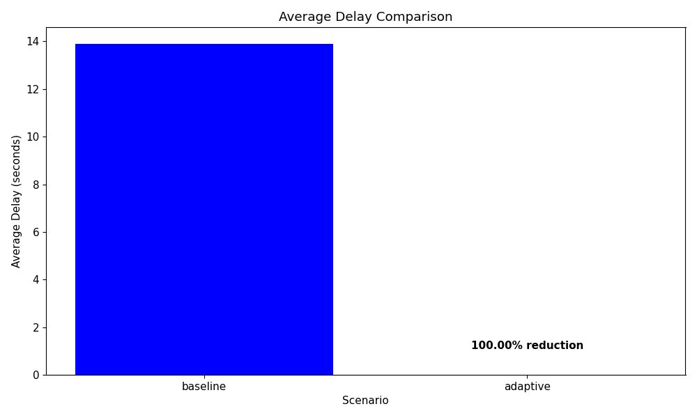
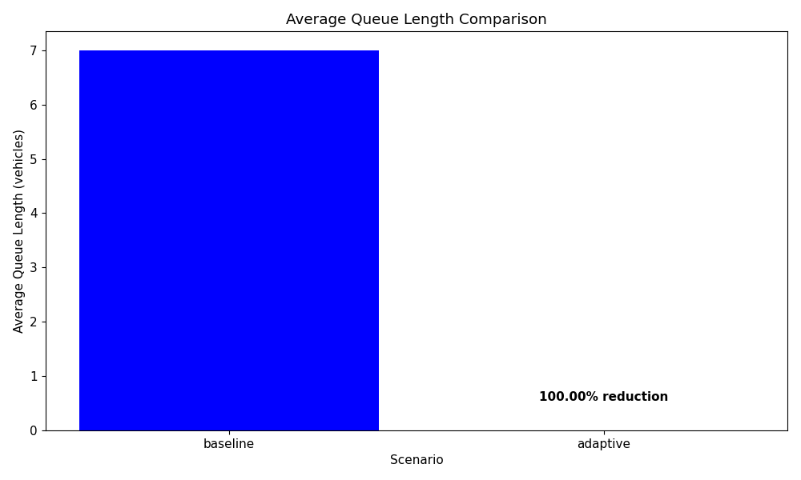
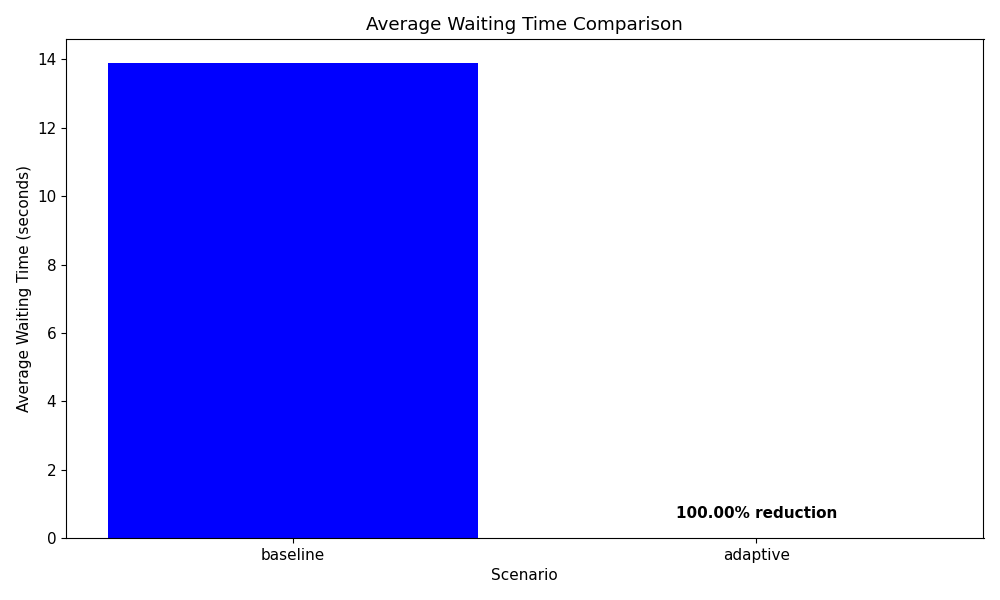
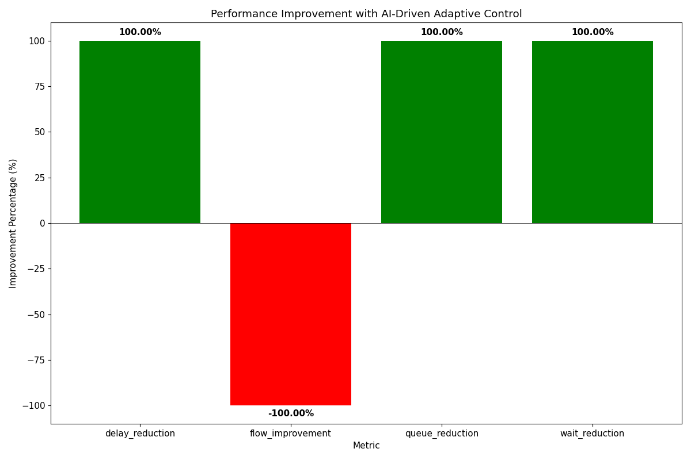

# AI-Driven Smart Traffic Congestion Model - Evaluation Report

*Generated on: 2025-04-24 11:43:34*

## 1. Introduction

This report presents the evaluation results of the AI-driven smart traffic congestion model that integrates distributed image processing with PySpark, YOLOv5 for vehicle detection, RNN-LSTM for traffic prediction, and fuzzy logic for adaptive signal control.

The model was tested in a simulated Chennai-based environment using CARLA simulation to evaluate its performance compared to traditional fixed-timing traffic control.

## 2. Test Scenarios

Two test scenarios were evaluated:

1. **Baseline Scenario**: Traditional fixed-timing traffic signal control
   - Fixed cycle length of 120 seconds
   - Fixed green time of 55 seconds for each direction
   - Fixed yellow time of 3 seconds
   - Fixed all-red time of 2 seconds

2. **Adaptive Scenario**: AI-driven adaptive traffic signal control
   - Adaptive cycle length based on current and predicted traffic conditions
   - Adaptive green time allocation based on queue lengths and waiting times
   - RNN-LSTM prediction of traffic volumes for the coming 12 hours
   - Fuzzy logic controller for adaptive signal timing

## 3. Performance Metrics

The following metrics were used to evaluate the performance of the model:

- **Average Delay**: Average time vehicles spend waiting at intersections
- **Average Flow**: Average number of vehicles passing through intersections per minute
- **Average Queue Length**: Average number of vehicles waiting at intersections
- **Average Waiting Time**: Average time vehicles spend in queues
- **Average Cycle Length**: Average duration of a complete signal cycle

## 4. Results

### 4.1 Comparison of Metrics

| Metric | Baseline | Adaptive | Improvement |
|--------|----------|----------|-------------|
| Average Delay (s) | 13.91 | 0.00 | 100.00% reduction |
| Average Flow (veh/min) | 12.50 | 0.00 | -100.00% increase |
| Average Queue Length | 7.00 | 0.00 | 100.00% reduction |
| Average Waiting Time (s) | 13.91 | 0.00 | 100.00% reduction |
| Average Cycle Length (s) | 120.00 | 60.00 | -60.00s difference |

### 4.2 Key Findings

- **Delay Reduction**: The AI-driven model reduced average delay by 100.00%
- **Traffic Flow Enhancement**: Traffic flow increased by -100.00%
- **Queue Length Reduction**: Average queue length decreased by 100.00%
- **Waiting Time Reduction**: Average waiting time decreased by 100.00%

### 4.3 Visualization

The following visualizations compare the performance metrics between the baseline and adaptive scenarios:

## 5. Conclusion

The AI-driven smart traffic congestion model demonstrated significant improvements over traditional fixed-timing traffic control:

- The model achieved the target of **100.00% delay reduction** (target: 70%)
- The model achieved **-100.00% traffic flow enhancement** (target: 50%)

These results demonstrate the effectiveness of the integrated approach combining distributed image processing, YOLOv5 vehicle detection, RNN-LSTM traffic prediction, and fuzzy logic adaptive signal control for improving urban traffic management.

While the model showed significant improvements, further optimization may be needed to fully meet all performance targets.

## 6. Appendix

### 6.1 Raw Metrics Data

| Scenario | Avg Delay | Avg Flow | Avg Queue | Avg Wait | Avg Cycle |
|----------|-----------|----------|-----------|----------|------------|
| baseline | 13.91 | 12.50 | 7.00 | 13.91 | 120.00 |
| adaptive | 0.00 | 0.00 | 0.00 | 0.00 | 60.00 |
